# ComfortZone

### 功能介绍：

【注】：用Chrome或firefox打开，别的会有好多bug

#### 登录注册：

输入网址进入登录注册页面：

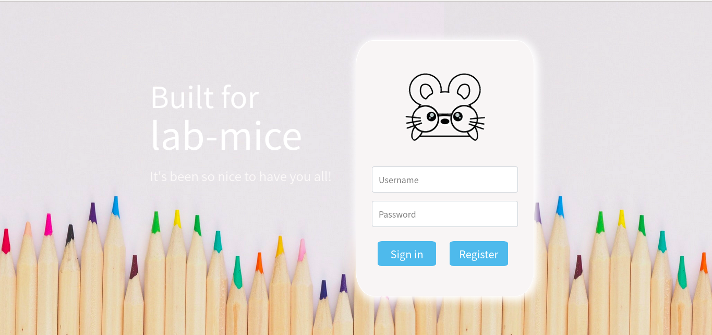

输入用户名和密码后点击注册按钮:

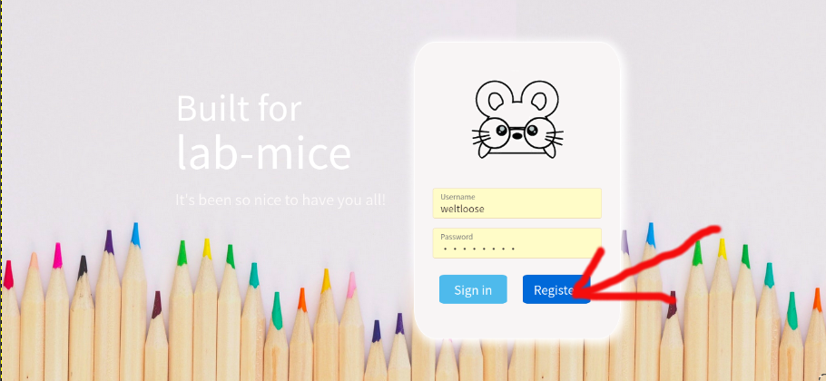

注册成功会出现这么注册成功的字样，然后直接点Sign in即可，如果该账号已经注册了，就直接Sign in

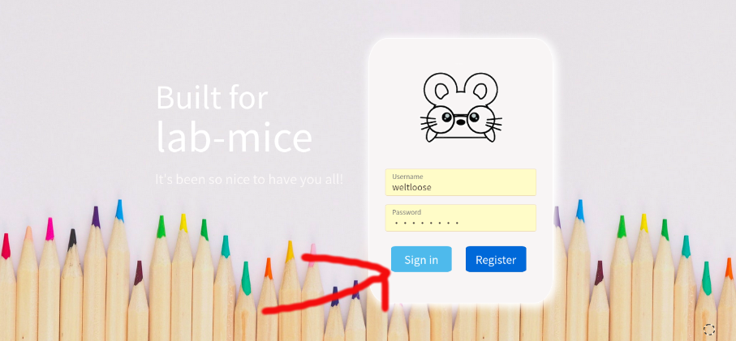

#### 主页面：

成功登录之后会进入主页面：

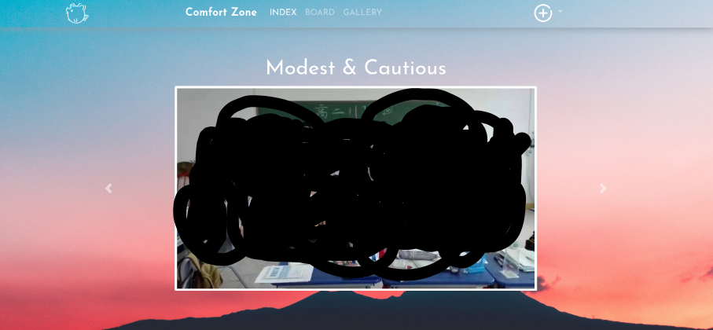

主要操作的部分在上边栏：

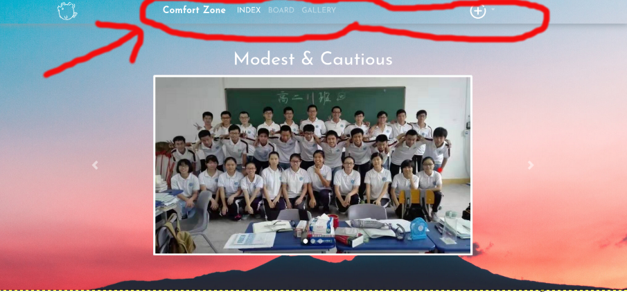

#### 留言板：

点击BOARD，

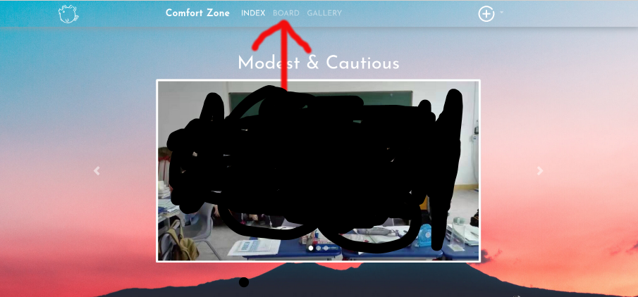

弹出一块板子

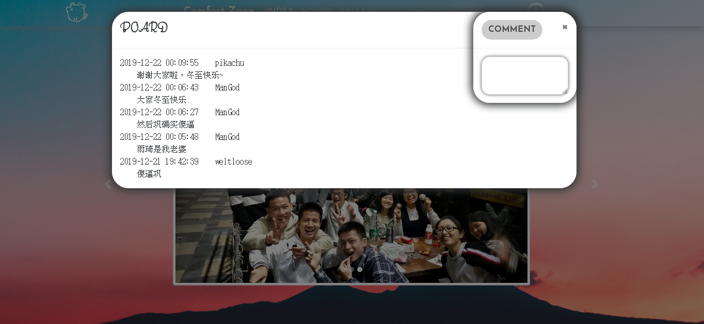

在COMMENT中写下你想留言的内容，然后点击COMMENT

就会将留言内容放到板子上

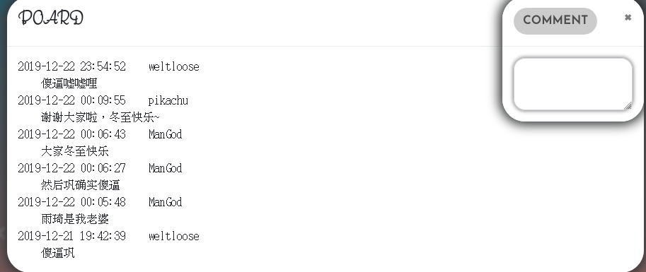

要想退出这块板子点击旁边的区域或是COMMENT的x即可

#### 上传图片

点击+

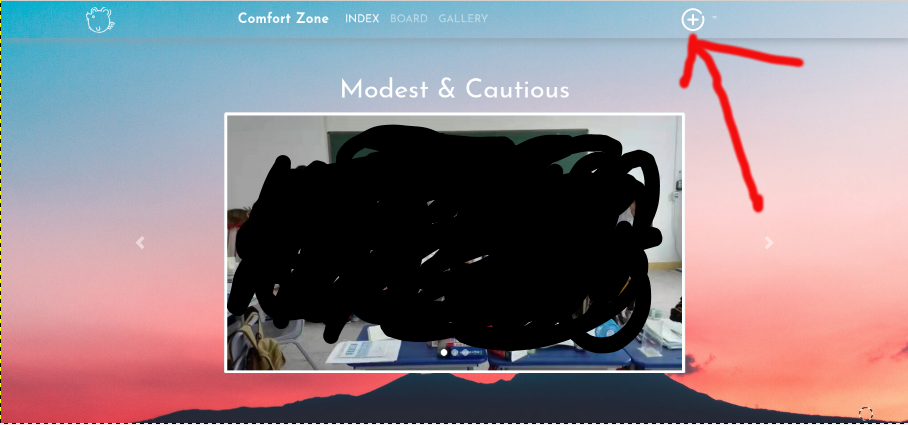

会弹出一个汉堡，然后点击Add Public Photoes（剩下两个还没实现，或将删除）

上传内容仅支持jpeg, gif, png, webp格式图片，其实格式文件将不会被保存

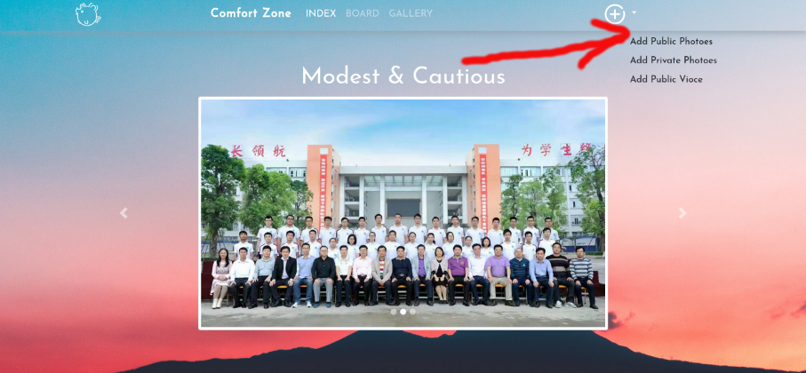

然后会弹出个框让你选择要上传的图片，支持一次上传多张图片

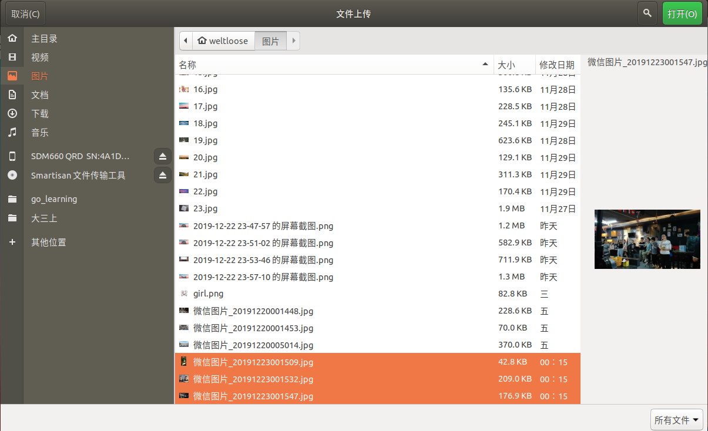

上传即可

【注】：要等到出现这个框才表示所有图片上传成功

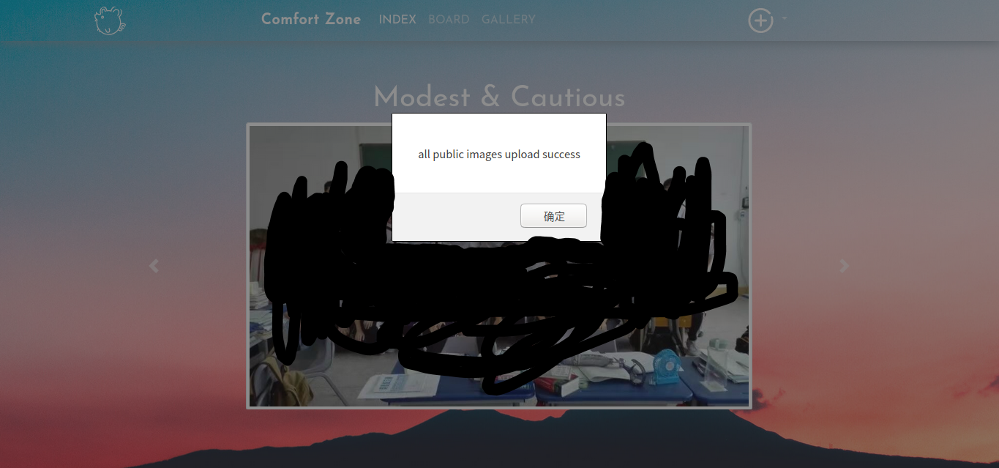

#### 图片展示

点击GALLERY

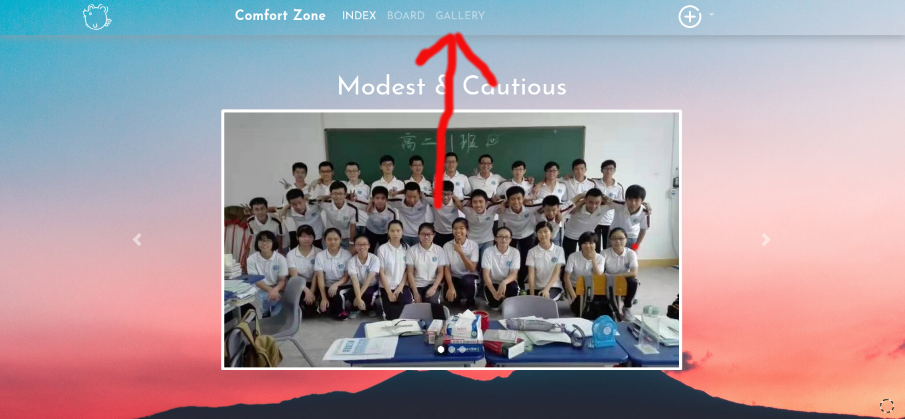

然后图片会自动加载进来

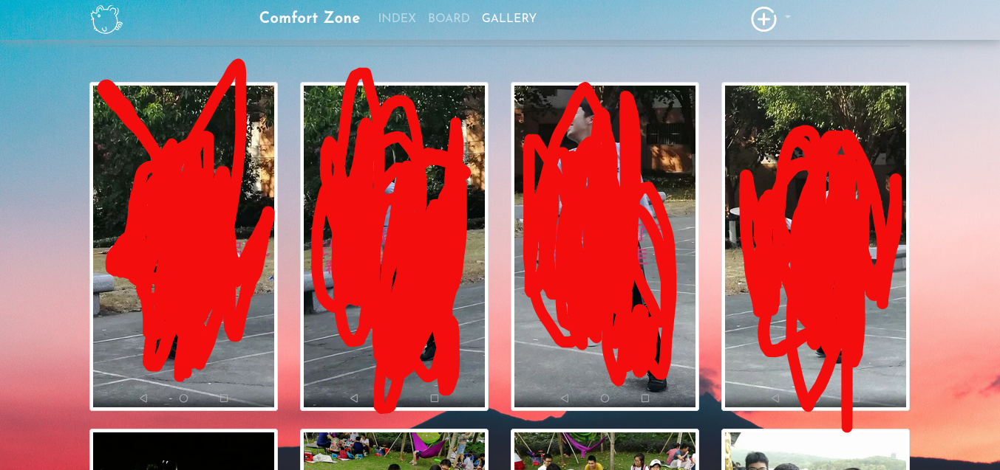

点击图片切换换另一种浏览方式

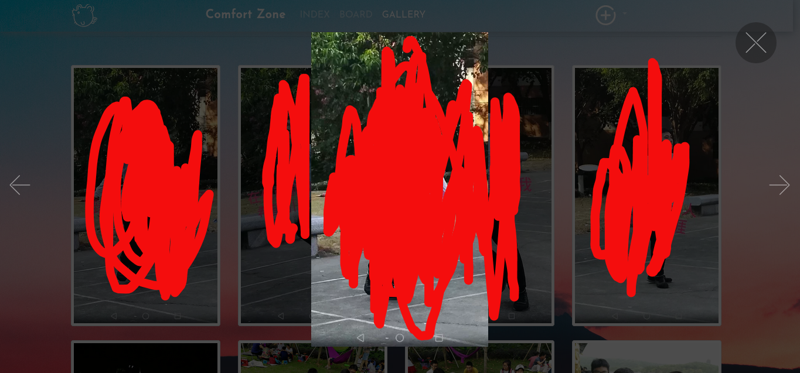

#### 更改密码

老规矩点击上面navbar的PASSWORD就会跳到更改密码的页面

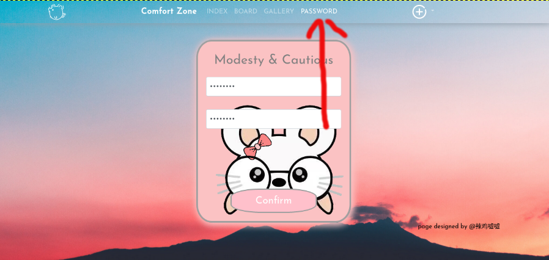

在文本框中输入你要改成啥密码，然后下面输入确认一遍，点击confirm就会跳出提示信息，提示更改成功或是失败

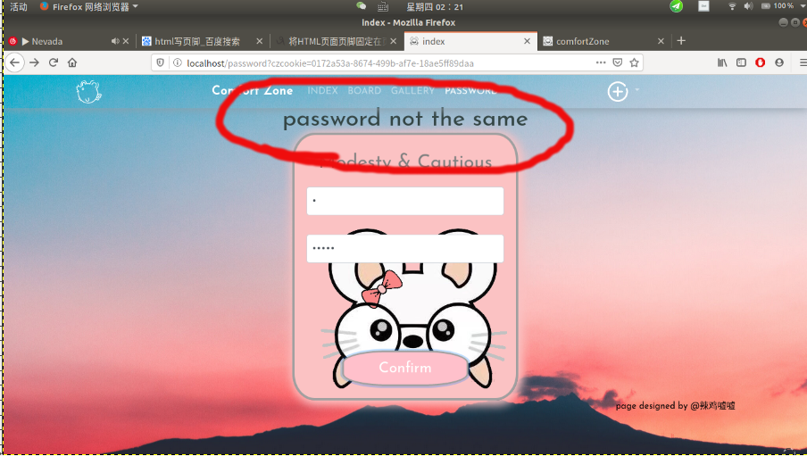

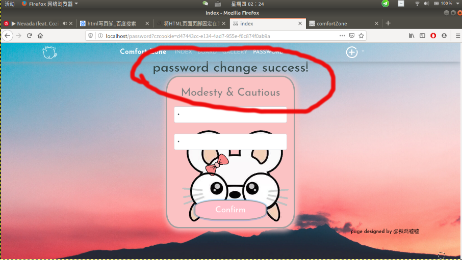

## 目前是这样，有需求或者是出了问题找我私聊就行

