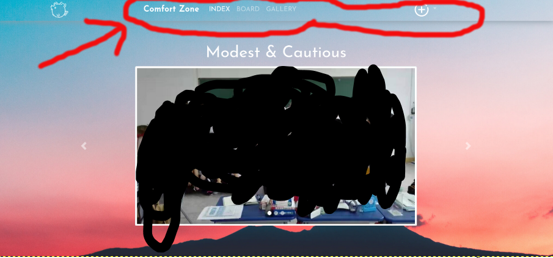
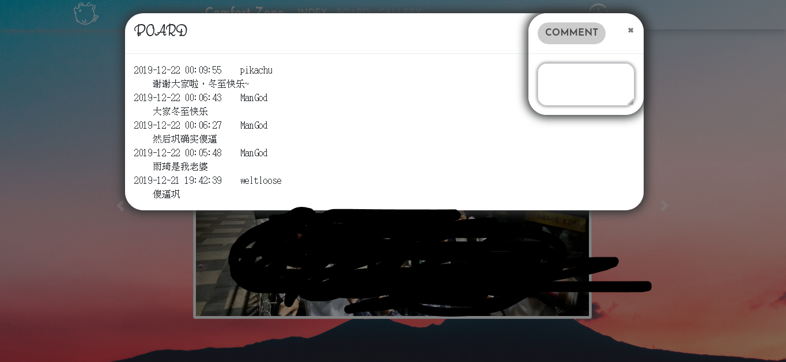
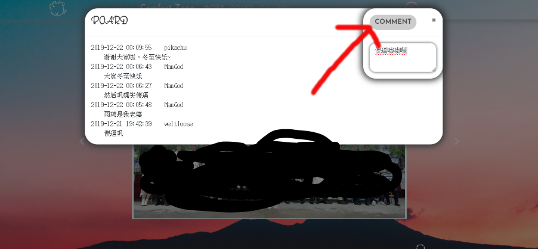
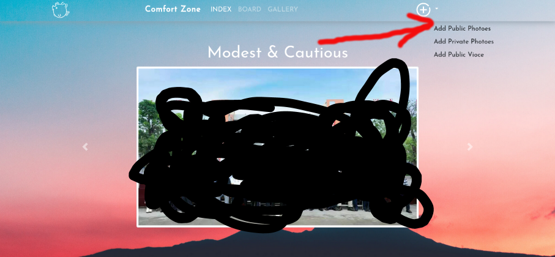
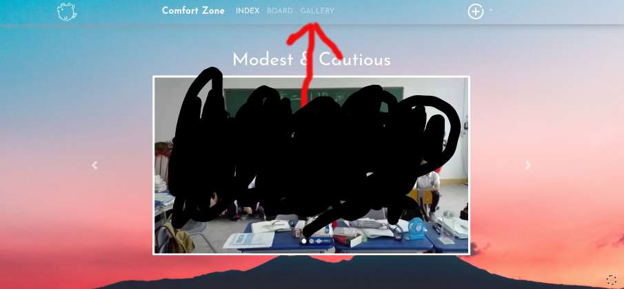

# ComfortZone

### 功能介绍：

【注】：用Chrome或firefox打开，别的会有好多bug

#### 登录注册：

输入网址进入登录注册页面：

输入用户名和密码后点击注册按钮（这里用户名要求不能使用中文）:

注册成功会出现这么注册成功的字样，然后直接点Sign in即可，如果该账号已经注册了，就直接Sign in

#### 主页面：

成功登录之后会进入主页面：

主要操作的部分在上边栏：

#### 留言板：

点击BOARD，

弹出一块板子

在COMMENT中写下你想留言的内容，然后点击COMMENT

就会将留言内容放到板子上

要想退出这块板子点击旁边的区域或是COMMENT的x即可

#### 上传图片

点击+

会弹出一个汉堡，然后点击Add Public Photoes（剩下两个还没实现，或将删除）

然后会弹出个框让你选择要上传的图片，支持一次上传多张图片

上传即可

【注】：要等到出现这个框才表示所有图片上传成功

#### 图片展示

点击GALLERY

然后图片会自动加载进来

点击图片切换换另一种浏览方式

## 目前是这样，有需求或者是出了问题找我私聊就行

